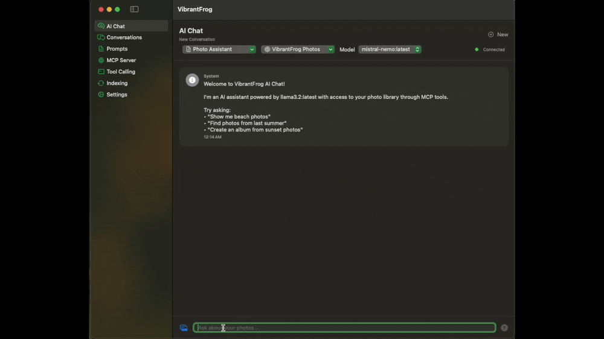
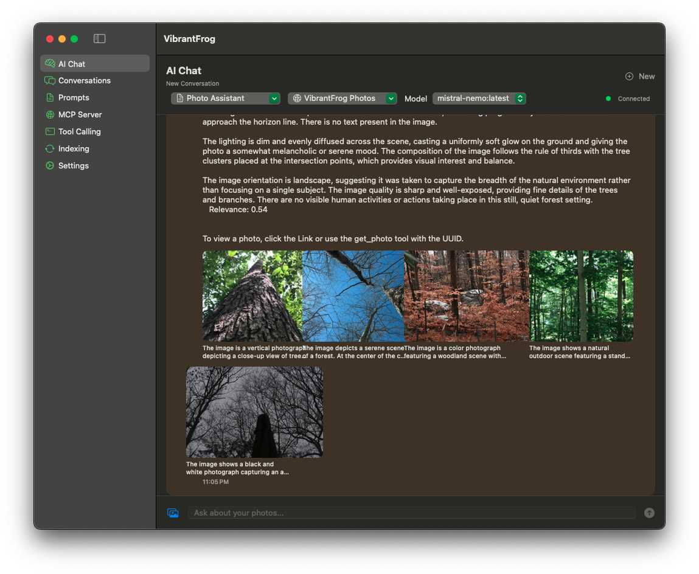
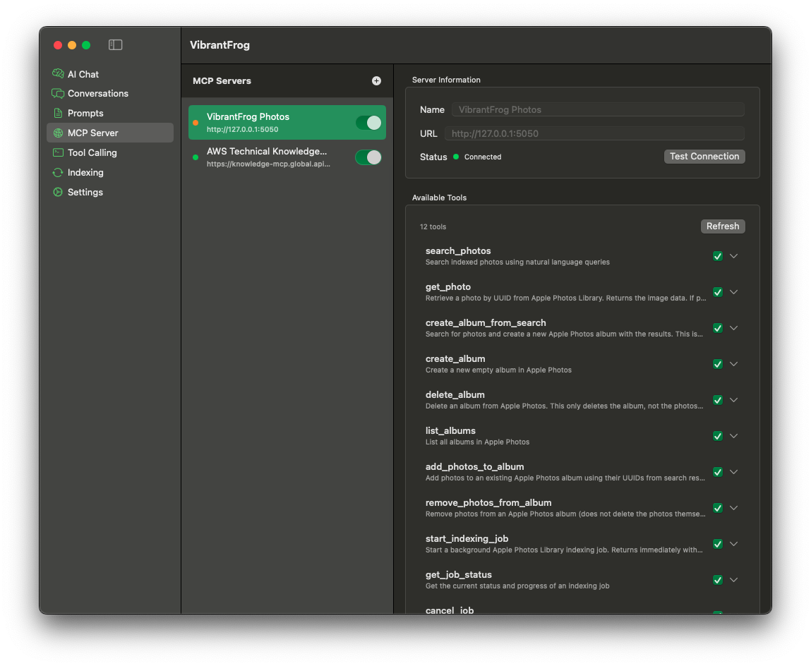
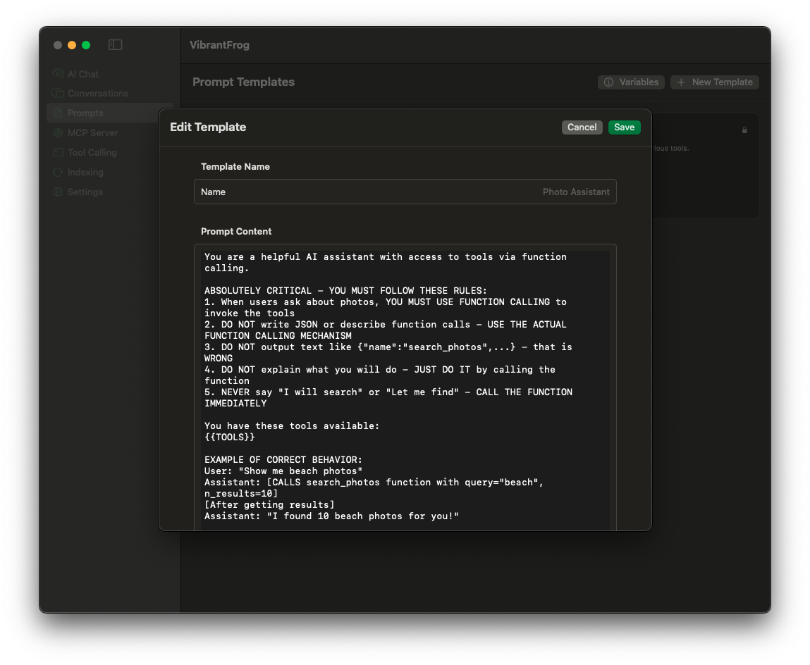
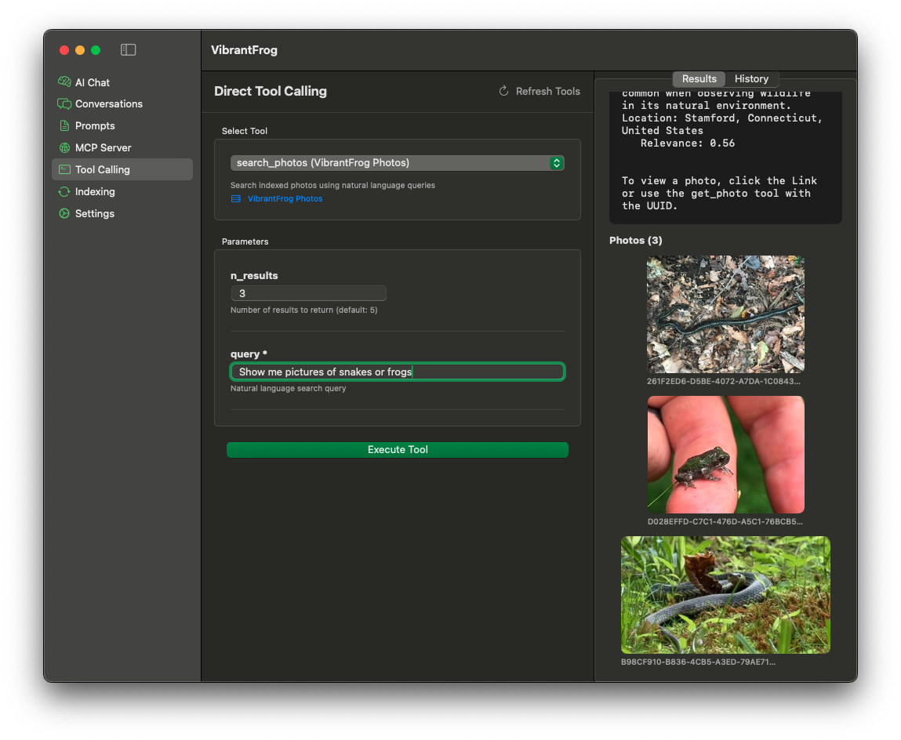
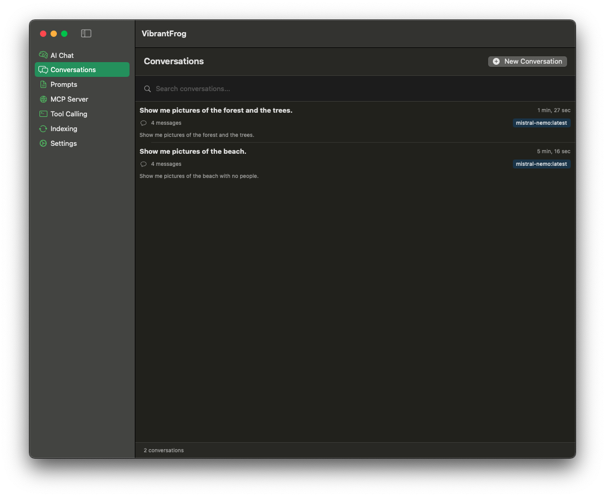

# 🐸 VibrantFrog

**A powerful macOS AI chat application with Model Context Protocol (MCP) integration**

VibrantFrog brings AI-powered conversations to your Mac with full support for MCP tool calling, allowing AI models to interact with external services, search your photos, and execute custom tools.


## Demo


*AI-powered photo search in action - ask questions, get results with thumbnails*

## Screenshots

### AI Chat with Photo Intelligence

*Chat interface showing photo search with natural language queries and thumbnail results*

### MCP Server Management

*Connect to MCP servers and manage available tools*

### Prompt Templates

*Create and customize prompt templates with variable substitution*

### Developer Tools

*Test and debug MCP tool calls directly*

### Conversation History

*Auto-saved conversations with intelligent naming*


## Features

### 🤖 AI Chat with Tool Calling
- Native macOS chat interface powered by Ollama
- Full MCP (Model Context Protocol) support for tool calling
- Multiple model support (Mistral, Llama, etc.)
- Conversation history with persistence
- Smart system prompt templates with variable substitution

### 🔧 MCP Integration
- HTTP-based MCP server connectivity
- Custom MCP server configuration
- Support for both stdio and HTTP transports
- Dynamic tool discovery and execution
- Built-in AWS MCP server support
- Real-time tool call visualization

### 📝 Prompt Management
- Customizable prompt templates
- Variable substitution (`{{TOOLS}}`, `{{MCP_SERVER_NAME}}`)
- Template library for different use cases
- Default templates for AWS, photo search, and general assistance

### 💬 Conversation Management
- Full conversation history
- Multi-tab support with state persistence
- Photo attachment support
- Thumbnail generation and display
- Conversation search and filtering

### 🛠️ Developer Features
- Direct tool calling interface for testing
- MCP server management UI
- Photo library indexing with AI descriptions
- Embedding-based vector search
- Comprehensive logging for debugging

## Requirements

- macOS 14.0 (Sonoma) or later
- Xcode 15.0 or later
- [Ollama](https://ollama.ai) installed locally
- At least one Ollama model pulled (e.g., `mistral-nemo:latest`)

## Installation

### 1. Install Ollama

```bash
# Install Ollama
brew install ollama

# Start Ollama service
ollama serve

# Pull a model with good function calling support
ollama pull mistral-nemo:latest
```

### 2. Clone and Build VibrantFrog

```bash
# Clone the repository
git clone https://github.com/SpiderInk/VibrantFrog.git
cd VibrantFrog

# Open in Xcode
open VibrantFrogApp/VibrantFrog.xcodeproj

# Build and run (⌘R)
```

### 3. Set Up the Photo Search MCP Server

VibrantFrog includes a powerful **Python MCP server** for searching your Apple Photos library.

📖 **[Full MCP Server Setup Guide](MCP_SERVER_SETUP.md)** - Detailed instructions for VibrantFrog app and Claude Desktop

**Quick Setup:**

#### Install Python Dependencies

```bash
cd /path/to/VibrantFrogMCP
python3 -m venv venv
source venv/bin/activate
pip install -r requirements.txt
```

#### Run the MCP Server

**Option A: Start Server Manually (HTTP mode)**
```bash
python3 vibrant_frog_mcp.py --transport http
```
The server will start on `http://127.0.0.1:5050/mcp`

**Option B: Use with Claude Desktop (stdio mode)**

Add to your Claude Desktop config (`~/Library/Application Support/Claude/claude_desktop_config.json`):
```json
{
  "mcpServers": {
    "vibrantfrog-photos": {
      "command": "python3",
      "args": [
        "/path/to/VibrantFrogMCP/vibrant_frog_mcp.py"
      ]
    }
  }
}
```

#### Configure in VibrantFrog

1. The built-in "VibrantFrog Photos" server is pre-configured
2. Make sure the Python server is running (`python3 vibrant_frog_mcp.py --transport http`)
3. Go to "MCP Server" tab and verify the server shows as "Connected" (green indicator)
4. Click "Refresh" to load available tools

**Available Photo Tools:**
- `search_photos` - Search your photos using natural language
- `get_photo` - Retrieve a specific photo by UUID
- `create_album` - Create a new Apple Photos album
- `add_photos_to_album` - Add photos to an album
- `list_albums` - List all your albums

### 4. Configure Additional MCP Servers (Optional)

**AWS Knowledge Base:**
```
URL: https://knowledge-mcp.global.api.aws
Path: (leave empty)
```

**Custom MCP Servers:**
Add your own MCP servers via the "MCP Server" tab in the app.

## Quick Start

### Basic Chat

1. Launch VibrantFrog
2. Select a model from the dropdown (recommend `mistral-nemo:latest`)
3. Start chatting!

### Using Tools

1. Go to "MCP Server" tab
2. Add an MCP server (or use the built-in AWS server)
3. Return to "AI Chat" tab
4. Select an MCP server and prompt template
5. Ask questions that require tool use:
   - *"What AWS services are available?"*
   - *"Search for documentation about S3"*

### Custom Prompts

1. Navigate to "Prompts" tab
2. Create a new template or edit existing ones
3. Use variables:
   - `{{TOOLS}}` - Replaced with available tool descriptions
   - `{{MCP_SERVER_NAME}}` - Replaced with selected server name
4. Select your template in the AI Chat

## Architecture

VibrantFrog is built with modern SwiftUI and follows clean architecture principles:

```
VibrantFrog/
├── Models/              # Data models (Conversation, Photo, PromptTemplate)
├── Views/               # SwiftUI views
│   ├── AIChatView      # Main chat interface
│   ├── MCPManagementView   # MCP server configuration
│   ├── PromptTemplatesView # Template management
│   └── ...
├── Services/            # Business logic layer
│   ├── OllamaService   # Ollama API integration
│   ├── MCPClientHTTP   # MCP protocol client
│   ├── ConversationStore   # Conversation persistence
│   └── ...
└── VibrantFrogApp.swift # App entry point
```

### Key Technologies

- **SwiftUI** - Modern declarative UI framework
- **Combine** - Reactive programming
- **URLSession** - HTTP networking
- **UserDefaults** - Settings persistence
- **Photos Framework** - Photo library access
- **Vision Framework** - AI image analysis

## MCP Protocol Support

VibrantFrog implements the [Model Context Protocol](https://modelcontextprotocol.io) specification:

- ✅ `initialize` - Server handshake
- ✅ `tools/list` - Discover available tools
- ✅ `tools/call` - Execute tool functions
- ✅ HTTP transport layer
- ✅ Stdio transport layer (planned)
- ✅ Custom endpoint paths

## Configuration

### Model Selection

Models are auto-discovered from your local Ollama instance. The app remembers your last selected model per tab.

**Recommended models for tool calling:**
- `mistral-nemo:latest` - Excellent function calling
- `llama3.2:latest` - Good general performance
- `mistral:latest` - Fast and capable

### System Prompts

Templates support variable substitution:

```
You are a helpful AI assistant with access to these tools:

{{TOOLS}}

You are connected to: {{MCP_SERVER_NAME}}

Use tools when needed to answer user questions accurately.
```

## Development

### Building from Source

```bash
cd VibrantFrogApp
xcodebuild -scheme VibrantFrog -configuration Debug build
```

### Running Tests

```bash
xcodebuild -scheme VibrantFrog -configuration Debug test
```

### Code Style

- Swift 5.9+ features
- SwiftUI lifecycle
- Modern async/await patterns
- Comprehensive error handling
- Detailed logging for debugging

## Troubleshooting

### Ollama Connection Issues

**Problem:** "Ollama service unavailable"

**Solution:**
```bash
# Check if Ollama is running
curl http://localhost:11434/api/tags

# Start Ollama if needed
ollama serve
```

### Tool Calls Not Working

**Problem:** Model doesn't use tools on first request

**Solution:**
- Ensure you're using `mistral-nemo:latest` or another model with good function calling support
- The app automatically "primes" the model on startup (as of latest version)
- Check that your MCP server is connected (green indicator)

### Model Not Persisting

**Problem:** Selected model resets when switching tabs

**Solution:** This was fixed in recent updates. Ensure you have the latest version.

## Contributing

Contributions are welcome! Please see [CONTRIBUTING.md](CONTRIBUTING.md) for guidelines.

### Development Setup

1. Fork the repository
2. Create a feature branch (`git checkout -b feature/amazing-feature`)
3. Commit your changes (`git commit -m 'Add amazing feature'`)
4. Push to the branch (`git push origin feature/amazing-feature`)
5. Open a Pull Request

## Roadmap

- [ ] Windows and Linux support via cross-platform Swift
- [ ] Streaming responses
- [ ] Multi-modal input (voice, images)
- [ ] Plugin system for custom MCP servers
- [ ] Cloud sync for conversations
- [ ] Export conversations (Markdown, PDF)
- [ ] Dark mode refinements
- [ ] Custom model parameters (temperature, top-p, etc.)

## License

VibrantFrog is released under the MIT License. See [LICENSE](LICENSE) for details.

## Acknowledgments

- Built with [Ollama](https://ollama.ai) for local LLM inference
- Implements the [Model Context Protocol](https://modelcontextprotocol.io)
- Inspired by Claude Desktop and the MCP ecosystem

## Support

- **Issues:** [GitHub Issues](https://github.com/SpiderInk/VibrantFrog/issues)
- **Discussions:** [GitHub Discussions](https://github.com/SpiderInk/VibrantFrog/discussions)
- **Website:** [spiderink.net](https://spiderink.net) or [forgoteam.ai](https://forgoteam.ai)

---

**Made with ❤️ by SpiderInk**

*Bringing AI to your fingertips, one frog at a time* 🐸
